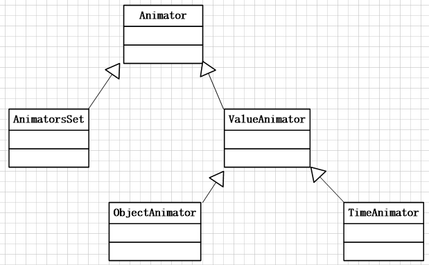
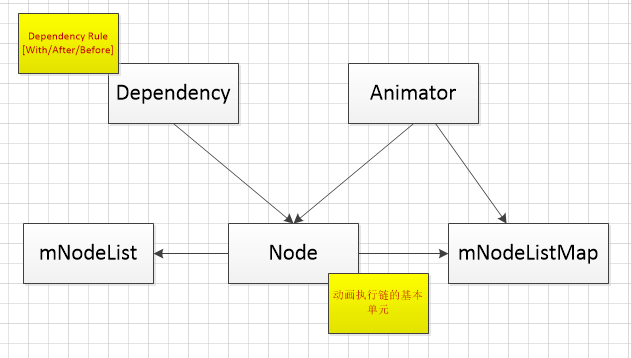

<!-- toc orderedList:0 depthFrom:1 depthTo:6 -->

- [Index](#index)
- [ViewAnimation](#viewanimation)
	- [DrawableAnimation](#drawableanimation)
		- [XML 方式](#xml-方式)
		- [JAVA 方式](#java-方式)
		- [小结](#小结)
	- [TranslateAnimation](#translateanimation)
		- [XML 方式](#xml-方式-1)
		- [JAVA 方式](#java-方式-1)
		- [小结](#小结-1)
	- [RotateAnimation](#rotateanimation)
		- [XML 方式](#xml-方式-2)
		- [JAVA 方式](#java-方式-2)
		- [小结](#小结-2)
	- [AlphaAnimation](#alphaanimation)
		- [XML 方式](#xml-方式-3)
		- [JAVA 方式](#java-方式-3)
		- [小结](#小结-3)
	- [ScaleAnimation](#scaleanimation)
		- [JAVA 方式](#java-方式-4)
		- [小结](#小结-4)
	- [AnimationSet](#animationset)
		- [XML 方式](#xml-方式-4)
		- [坑1：在`AnimationSet`中设置`repeatCount`属性不会有任何的作用](#坑1在animationset中设置repeatcount属性不会有任何的作用)
		- [坑2：`TranslateAnimation`对于`pivotXxx`属性的影响](#坑2translateanimation对于pivotxxx属性的影响)
	- [ViewAnimation 设计框架](#viewanimation-设计框架)
- [PropertyAnimator](#propertyanimator)
	- [Why PropertyAnimator](#why-propertyanimator)
	- [ObjectAnimator](#objectanimator)
		- [入门使用](#入门使用)
		- [使用方式探究](#使用方式探究)
		- [PropertyValuesHolder](#propertyvaluesholder)
	- [ValueAnimator](#valueanimator)
	- [Interpolator & TypeEvaluator](#interpolator-typeevaluator)
		- [Interpolator](#interpolator)
		- [TypeEvaluator](#typeevaluator)
		- [Interpolator provide by Android](#interpolator-provide-by-android)
		- [小结](#小结-5)
	- [Deal with all properties by PropertyAnimator](#deal-with-all-properties-by-propertyanimator)
		- [方法一：使用ValueAnimator](#方法一使用valueanimator)
		- [方法二：继承后添加`getter/setter`](#方法二继承后添加gettersetter)
		- [方法三：使用包装器](#方法三使用包装器)
	- [LayoutTransition](#layouttransition)
	- [Framework](#framework)
		- [Animator](#animator)
		- [AnimatorSet](#animatorset)
- [ViewPropertyAnimator](#viewpropertyanimator)
	- [KeyWords](#keywords)
	- [Design Purpose](#design-purpose)
	- [Usage](#usage)

<!-- tocstop -->

# Index

1. ViewAnimation

  - What is ViewAnimation
  - Introduce various ViewAnimation

    - DrawableAnimation
    - TranslateAnimation
    - RotateAnimation
    - ScaleAnimation
    - AlphaAnimation
    - AnimationSet
    - Structure
    - ViewAnimation Source inspect

2. Property Animator

  - Why PropertyAnimator
  - Introduce ObjectAnimator
  - Introduce ValueAnimator
  - Custom Interpolator & TypeEvaluator
  - Deal with all property with PropertyAnimator
  - Introduce LayoutTransition
  - Framework

3. ViewPropertyAnimator

  - KeyWords
  - Design Purpose
  - Usage

4. Advence Example

# ViewAnimation

其实，在Android的文档中是将补间动画(TweenAnimation)和帧动画(DrawableAnimation)两者合属性动画放置在同一级别介绍的，但是经过一定时间的研究感觉目前这两种动画的重要性和实用性都在慢慢降低并且两者也是同一时期提出使用同一套动画类框架的特性，所以在这里就直接将两者放置在ViewAnimation下面的第二层级来介绍。

两者的功能大体上可以说是相同的，都是在View对象上执行显示出动画效果。不过补间动画是通过对View对象的影像进行`translate/rotate/alpha/scale`的一系列的操作表达出动画效果；而帧动画则是简单粗暴许多，直接在`ImageView`中顺序播放达到显示动画目的。从上面的表述来看，感觉补间动画是要比帧动画要复杂许多的，但是帧动画的每一帧都对应着一张图片资源这样子方式必然会增加应用的体量，一不小心还可能会造成OOM的情况。所以就个人的感受来说，在动画描述比较复杂并且是可以用比较少的帧数进行描述的动画才会去选择使用帧动画。和帧动画相比，补间动画可能会显得更加有内涵一点。在补间动画中，为了达到需求的动画效果会不断地计算当前时间消耗从而获得View正确的状态，然后再通过对View的影像进行操作使得View在一个时间间隔内达到动画的效果。在这表述中需要注意的一个地方是`对View的影像进行操作`，因为在View的工作流程中只有在最后绘制在Canvas上的图像才是我们看到的内容，而这里所说的影像指代的即使Canvas上绘制出来的内容。之所以说在这个地方需要注意一下是因为动画的操作在改变了View的影像时并不会对View的位置进行改变，所以如果我们在通过补间动画移动了一个View之后再想去点击这个View触发其设定好的单击事件是没有任何反应的，因为这个View实际的位置还停留在原来的地方，单击图像所在的位置不能够将点击事件传递到该View上。

ViewAnimation在使用的方式上都可以通过Xml或者JavaSourceCode创建动画然后再执行，一般情况下推荐使用前者。因为使用Xml的方式构建动画会让各个属性显得更加直观可控，同时复用性更强一点。并且，在ViewAnimation这套类框架中对Xml定义的动画资源的加载和使用提供了相当方便的接口。

## DrawableAnimation

DrawableAnimation 的关键类是`AnimationDrawable`。可以将`AnimationDrawable`看成是一系列`Drawable`对象的集合，这个集合中的每一个`Drawable`对象都是后续动画播放过程中的一帧，在创建`AnimationDrawable`的时候可以为每一帧设定播放的时长。下面贴出一些在这个类中比较关键源代码备忘一下：

```java
  public class AnimationDrawable extends DrawableContainer implements Runnable, Animatable{
    private AnimationState mAnimationState;

    /** The current frame, ranging from 0 to {@link #mAnimationState#getChildCount() - 1} */
    private int mCurFrame = 0;

    /** Whether the drawable has an animation callback posted. */
    private boolean mRunning;

    /** Whether the drawable should animate when visible. */
    private boolean mAnimating;

    /**
     * Starts the animation, looping if necessary. This method has no effect
     * if the animation is running.
     * <p>
     * <strong>Note:</strong> Do not call this in the
     * {@link android.app.Activity#onCreate} method of your activity, because
     * the {@link AnimationDrawable} is not yet fully attached to the window.
     * If you want to play the animation immediately without requiring
     * interaction, then you might want to call it from the
     * {@link android.app.Activity#onWindowFocusChanged} method in your
     * activity, which will get called when Android brings your window into
     * focus.
     *
     * @see #isRunning()
     * @see #stop()
     */
    @Override
    public void start() {
        mAnimating = true;

        if (!isRunning()) {
            // Start from 0th frame.
            setFrame(0, false, mAnimationState.getChildCount() > 1
                    || !mAnimationState.mOneShot);
        }
    }

    /**
     * Stops the animation. This method has no effect if the animation is not
     * running.
     *
     * @see #isRunning()
     * @see #start()
     */
    @Override
    public void stop() {
        mAnimating = false;

        if (isRunning()) {
            unscheduleSelf(this);
        }
    }


    /**
     * Indicates whether the animation is currently running or not.
     *
     * @return true if the animation is running, false otherwise
     */
    @Override
    public boolean isRunning() {
        return mRunning;
    }

    /**
     * @return The number of frames in the animation
     */
    public int getNumberOfFrames() {
        return mAnimationState.getChildCount();
    }

    /**
     * @return The Drawable at the specified frame index
     */
    public Drawable getFrame(int index) {
        return mAnimationState.getChild(index);
    }

    /**
     * @return The duration in milliseconds of the frame at the
     *         specified index
     */
    public int getDuration(int i) {
        return mAnimationState.mDurations[i];
    }

    /**
     * @return True of the animation will play once, false otherwise
     */
    public boolean isOneShot() {
        return mAnimationState.mOneShot;
    }

    /**
     * Sets whether the animation should play once or repeat.
     *
     * @param oneShot Pass true if the animation should only play once
     */
    public void setOneShot(boolean oneShot) {
        mAnimationState.mOneShot = oneShot;
    }

    /**
     * Adds a frame to the animation
     *
     * @param frame The frame to add
     * @param duration How long in milliseconds the frame should appear
     */
    public void addFrame(@NonNull Drawable frame, int duration) {
        mAnimationState.addFrame(frame, duration);
        if (!mRunning) {
            setFrame(0, true, false);
        }
    }

  }
```

下面会用一下比较简单的源码介绍一下DrawableAnimation的两种不同的使用方式。

### XML 方式

从归属上来说，AnimationDrawable的XML文件应该放置在`res/drawable`目录下进行管理和访问。该XML文件中开头是一个`animation-list`的根节点然后在这个根节点中包含一个或多个`item`，每一个`item`代表的是在AnimationDrawable中的一帧对应的配置。

```xml
<!-- test_drawable_animation -->
<?xml version="1.0" encoding="utf-8"?>
<animation-list xmlns:android="http://schemas.android.com/apk/res/android"
    android:oneshot="true">
    <item android:drawable="@drawable/d1" android:duration="100"/>
    <item android:drawable="@mipmap/p2" android:duration="100"/>
    <item android:drawable="@mipmap/p3" android:duration="100"/>
    <item android:drawable="@mipmap/p4" android:duration="100"/>
</animation-list>
```

上面的XML代码定义了一个AnimationDrawable对象。在这个定义过程中除了设定每一帧的资源之外，还会设定一些播放上的属性，比如是否重复播放，每一帧动画播放的时间长度等等。

```java
ImageView mImageView = (ImageView) findViewById(R.id.iv_test);
mImageView.setBackgroundResource(R.drawable.test_drawable_animation);
AnimationDrawable drawable = (AnimationDrawable) mImageView.getBackground();
drawable.start();
```

上面的代码会将设置好的AnimationDrawable通过一个ImageView获取出来，然后再根据AnimationDrawable类提供的接口进行对应的动画操作。

### JAVA 方式

就像之前在介绍ViewAnimation的时候提及到那样，这一类型的动画都可以使用Xml或者是java的方式进行创建，不过使用Java创建的方式就会略微显得有些繁琐和笨拙。下面的这段代码使用之前贴出来的AnimationDrawable的关键源码创建与上面相同的帧动画。

```java
AnimationDrawable drawable = new AnimationDrawable();
drawable.addFrame(getResources().getDrawable(R.mipmap.p1),100);
drawable.addFrame(getResources().getDrawable(R.mipmap.p2),100);
drawable.addFrame(getResources().getDrawable(R.mipmap.p3),100);
drawable.addFrame(getResources().getDrawable(R.mipmap.p4),100);
drawable.setOneShot(false);
mFrameIV.setBackground(drawable);
drawable.start();
```

### 小结

AnimationDrawable本质上只是一个Drawable资源的集合而已，设定的每一个Drawable在帧动画代表着一帧。在设置完成播放动画时需要的资源之后，就可以使用AnimationDrawable提供的接口对动画的播放进行控制。

## TranslateAnimation

TranslateAnimation 通过一系列的配置，将View的图像进行水平方向的移动，为View提供水平运动的动画效果。因为这个类的源代码目前层测可以讲的东西并不多，所以这里就直接开始介绍怎么使用以及使用过程一些要注意的地方就完了。

### XML 方式

```xml
<?xml version="1.0" encoding="utf-8"?>
<translate xmlns:android="http://schemas.android.com/apk/res/android"
    android:fillAfter="true"
    android:fromXDelta="0"
    android:fromYDelta="0"
    android:toXDelta="70"
    android:toYDelta="70"
    android:duration="2000"
    android:interpolator="@android:anim/linear_interpolator"
    android:repeatMode="restart"
    android:repeatCount="4"/>
```

```java
TranslateAnimation animation = (TranslateAnimation) AnimationUtils.loadAnimation(this, R.anim.animation_translate);
mActorView.startAnimation(animation);
```

上面的XML代码基本上覆盖了所有在TranslateAnimation中需要涉及到的属性点。

- `fromXxxDelta\toXxxDelta`属性设置位移动画的起始位置和终点位置和View本身起始坐标的偏移量，使用的属性值有三种不同的类型；如果是采用整数的属性值，如`toXDelta="10"`表示终点位置在父容器坐标系X轴10像素的位置；如果采用百分数的属性值，如`toXDelta="10%"`表示的是终点位置的X轴坐标再当前View宽度10%的地方；如果采用100%p的方式，如`toXDelta="10%p"`表示终点位置的X坐标是当前View父容器宽度10%的地方。

- `duration`属性设置整个动画执行的过程持续的时间长度

- `interpolator`属性设置动画进行过程中中运动状态的改变，直观一点的说法就是运动速度的变化，上面的示例代码中使用的`linear_interpolator`就是表示在整个动画的过程中运行速度都是线性不变的，Android本身提供了很多预定的`Interpolator`，同时也提供自定义的途径，这部分内容在专门介绍`Interpolator`的时候会提及到

- `repeatMode`属性设置动画的重复方式，有两种不同的类型可以选择，如果使用`repeatMode = "restart"`每次重复动画的时候都是直接从动画的起始位置再次启动进行重复，而使用`repeatMode = "reverse"`会在重复动画的时候在播放结束的位置方向播放上一次播放的动画

- `repeatCount`属性设置动画的重复次数，任意正整数的值都表示对应的重复次数，如果使用-1则表示动画将会无限地重复播放

- `fillAfter`属性表示在动画结束的时候View将会保持结束时候的状态停留在该位置上，但是这里停留的只是View的影像，所以对该影像进行任何的触摸交互都是无法触发对应的事件的。上面介绍的这些属性都是ViewAnimation中的公共属性，在后面涉及的时候将不会重复提及而直接参考这里就可以了。

### JAVA 方式

使用java的方式创建`TranslateAnimation`只是在创建了该对象之后将上面对应的属性设置好就可以，只是对于`fromXxxDelta/toXxxDelta`的特殊用法支持的效果没有那么好，不过然后可以通过使用代码直接计算出来所需要的距离值。

```java
TranslateAnimation animation;
animation = new TranslateAnimation(0, 200, 0, 200);
animation.setDuration(2000);
animation.setInterpolator(new LinearInterpolator());
animation.setRepeatCount(4);
animation.setRepeatMode(Animation.RESTART);
mActorView.startAnimation(animation);
```

### 小结

使用平移动画的时候只需要对TranslateAnimation对象的对应属性进行设置，剩下的事情Android本身的动画机制会自动完成，主要的问题是在设置位移位置属性的时候填入的参数具有其他两个特殊的使用方式。

## RotateAnimation

旋转动画会依据设定好的旋转中心，对View的图像旋转操作。

### XML 方式

```xml
<?xml version="1.0" encoding="utf-8"?>
<rotate xmlns:android="http://schemas.android.com/apk/res/android"
    android:pivotX="50%"
    android:pivotY="50%"
    android:fromDegrees="0"
    android:toDegrees="360"
    android:repeatMode="restart"
    android:repeatCount="-1"
    android:duration="1000"
    android:interpolator="@android:anim/bounce_interpolator"/>
```

```java
RotateAnimation animation = (RotateAnimation) AnimationUtils.loadAnimation(R.anim.animation_rotate);
mActorView.startAnimation(animation);
```

上面的示例代码创建并运行了一个经典的旋转动画，现在针对代码中涉及到的`RotateAnimation`的属性进行介绍，关于`ViewAnimation`的公共属性在这里会跳过，需要的话可以参考`TranslateAnimation`的介绍部分。

- `pivotX/pivotX`属性表示执行动画的View在旋转的过程中依赖的旋转中心，这两个属性的取值和`TranslateAnimation#fromXxxDelta`类似的有三种不同的情况。
- `fromDegrees/toDegrees`属性表示动画的起始位置和结束位置View的角度

### JAVA 方式

```java
RotateAnimation animation = new RotateAnimation(0, 360, mActorView.getWidth()/2, mActorView.getHeight()/2);
animation.setDuration(1000);
animation.setRepeatMode(Animation.RESTART);
animation.setRepeatCount(Animation.INFINITE);
animation.setInterpolator(new BounceInterpolator());
mActorView.startAnimation(animation);
```

上面的代码简单地复制了XML代码描述的旋转动画的属性创建了一个`RotateAnimation`对象并执行该旋转动画。在这段示例代码中需要注意的地方只是`RotateAnimation`提供了多个不同的构造函数进行创建，这样做的目的是为了保证某些动画属性只能够在创建该动画的时候进行设置从而避免在动画创建之后再去对这些属性进行更改的可能性，下面贴出一下`RotateAnimation`的构造函数源代码。

```java
public class RotateAnimation extends Animation {
  /**
   * Constructor to use when building a RotateAnimation from code.
   * Default pivotX/pivotY point is (0,0).
   *
   * @param fromDegrees Rotation offset to apply at the start of the
   *        animation.
   *
   * @param toDegrees Rotation offset to apply at the end of the animation.
   */
  public RotateAnimation(float fromDegrees, float toDegrees) {
      mFromDegrees = fromDegrees;
      mToDegrees = toDegrees;
      mPivotX = 0.0f;
      mPivotY = 0.0f;
  }

  /**
   * Constructor to use when building a RotateAnimation from code
   *
   * @param fromDegrees Rotation offset to apply at the start of the
   *        animation.
   *
   * @param toDegrees Rotation offset to apply at the end of the animation.
   *
   * @param pivotX The X coordinate of the point about which the object is
   *        being rotated, specified as an absolute number where 0 is the left
   *        edge.
   * @param pivotY The Y coordinate of the point about which the object is
   *        being rotated, specified as an absolute number where 0 is the top
   *        edge.
   */
  public RotateAnimation(float fromDegrees, float toDegrees, float pivotX, float pivotY) {
      mFromDegrees = fromDegrees;
      mToDegrees = toDegrees;

      mPivotXType = ABSOLUTE;
      mPivotYType = ABSOLUTE;
      mPivotXValue = pivotX;
      mPivotYValue = pivotY;
      initializePivotPoint();
  }

  /**
   * Constructor to use when building a RotateAnimation from code
   *
   * @param fromDegrees Rotation offset to apply at the start of the
   *        animation.
   *
   * @param toDegrees Rotation offset to apply at the end of the animation.
   *
   * @param pivotXType Specifies how pivotXValue should be interpreted. One of
   *        Animation.ABSOLUTE, Animation.RELATIVE_TO_SELF, or
   *        Animation.RELATIVE_TO_PARENT.
   * @param pivotXValue The X coordinate of the point about which the object
   *        is being rotated, specified as an absolute number where 0 is the
   *        left edge. This value can either be an absolute number if
   *        pivotXType is ABSOLUTE, or a percentage (where 1.0 is 100%)
   *        otherwise.
   * @param pivotYType Specifies how pivotYValue should be interpreted. One of
   *        Animation.ABSOLUTE, Animation.RELATIVE_TO_SELF, or
   *        Animation.RELATIVE_TO_PARENT.
   * @param pivotYValue The Y coordinate of the point about which the object
   *        is being rotated, specified as an absolute number where 0 is the
   *        top edge. This value can either be an absolute number if
   *        pivotYType is ABSOLUTE, or a percentage (where 1.0 is 100%)
   *        otherwise.
   */
  public RotateAnimation(float fromDegrees, float toDegrees, int pivotXType, float pivotXValue,
          int pivotYType, float pivotYValue) {
      mFromDegrees = fromDegrees;
      mToDegrees = toDegrees;

      mPivotXValue = pivotXValue;
      mPivotXType = pivotXType;
      mPivotYValue = pivotYValue;
      mPivotYType = pivotYType;
      initializePivotPoint();
  }
}
```

### 小结

和`TranslateAnimation`的使用过程类似，在`ViewAnimation`的框架中为`XML/JAVA`两种不同的创建旋转动画的方式都提供了很好的支持，只是在使用的时候需要稍微注意`pivotX/pivotY`属性的使用。同时在这里仍然可以看到使用`XML`的创建方式仍然可以让创建的动画有更好的复用性

## AlphaAnimation

`AlphaAnimation`控制View图像透明度变化的动画

### XML 方式

```xml
<?xml version="1.0" encoding="utf-8"?>
<alpha xmlns:android="http://schemas.android.com/apk/res/android"
    android:fromAlpha="0"
    android:toAlpha="1"
    android:duration="1000"
    android:repeatMode="reverse"
    android:repeatCount="infinite"
    android:interpolator="@android:anim/linear_interpolator"/>
```

```java
AlphaAnimation animation = (AlphaAnimation) AnimationUtils.loadAnimation(this, R.anim.animation_alpha);
mActorView.startAnimation(animation);
```

上面的示例代码使用XML的方式构建并运行了一个简单的透明度动画，在这个动画的创建过程中之用到了一组其专属的属性`fromAlpha/toAlpha`用来设定动画开始位置和结束为止View的透明度,取值范围0~1表示从全透明到完全不透明。

### JAVA 方式

```java
AlphaAnimation animation = new AlphaAnimation(0, 1);
animation.setDuration(1000);
animation.setRepeatCount(Animation.INFINITE);
animation.setRepeatMode(Animation.REVERSE);
animation.setInterpolator(new LinearInterpolator());
mActorView.startAnimation(animation);
```

使用JAVA代码的方式创建和上面一样的动画并运行。

### 小结

上面的示例介绍了怎样通过XML和JAVA两种不同的方式去创建透明动画，这个动画相对来说是最简单的，涉及到的属性基本就只有那一对。

## ScaleAnimation

`ScaleAnimation`控制View执行依据一定的中心点进行XY方向的缩放动画

```xml
<?xml version="1.0" encoding="utf-8"?>
<scale xmlns:android="http://schemas.android.com/apk/res/android"
  android:pivotX="50%"
  android:pivotY="50%"
  android:duration="1000"
  android:fromXScale="1"
  android:fromYScale="1"
  android:repeatCount="infinite"
  android:repeatMode="reverse"
  android:toXScale="1.5"
  android:toYScale="1.5" />
```

```java
ScaleAnimation animation = (ScaleAnimation) AnimationUtils.loadAnimation(this, R.anim.animation_scale);
mActorView.startAnimation(animation);
```

上面的示例代码中基本上使用了放缩动画所有属性创建并执行一个放缩动画。在这些属性中大部分是之前已经介绍过的一些公共属性，比如在`RotateAnimation`中提及到的`pivotY/pivotX`属性；自身特有的属性就只是设置动画在XY方向上的放缩比例的`fromXxxScale/toXxxScale`这组属性，这组属性设置对应方向上在动画开始和结束两个不同位置的放缩比例，取值为1的时候表示维持原有大小不进行任何的放缩操作，其他的取值按照1的比例进行对应的放缩。

### JAVA 方式

```java
ScaleAnimation animation = new ScaleAnimation(1.0f, 1.5f, 1.0f, 1.5f, mActorView.getWidth()/2, mActorView.getHeight()/2);
animation.setDuration(1000);
animation.setRepeatMode(Animation.REVERSE);
animation.setRepeatCount(Animation.INFINITE);
mActorView.startAnimation(animation);
```

参考`RotateAnimation`的介绍，在`ScaleAnimation`中同样提供了多种不同的构造函数避免某些属性在动画创建完之后被更改。因为在java代码中没有办法像XML中一样对中心位置属性采用比较方便的百分比设置，所以只能够手动计算出中心位置的像素进行赋值。

### 小结

仅仅就使用方式而已，`ScaleAnimation`和`RotateAnimation`是非常相似的，同样需要设定对应的开始状态，运动姿态同样会受到中心位置的影响，中心位置属性的取值同样有三种不同方式，同样会提供几个不同类型的构造函数避免属性在不正确的时候被更改。

## AnimationSet

`AnimationSet`是一个动画的集合，在该对象的内部维护着一个补间动画的集合，在每一次刷新UI或者是每一个动画帧的时候都会依次地执行这个集合里面的动画。下面还是依照惯例分别介绍这个类的两种不同使用方式。

### XML 方式

```xml
<?xml version="1.0" encoding="utf-8"?>
<set xmlns:android="http://schemas.android.com/apk/res/android"
    android:duration="5000"
    android:interpolator="@android:anim/linear_interpolator"
    android:repeatMode="reverse"
    android:shareInterpolator="true">

    <rotate
        android:fromDegrees="0"
        android:pivotX="50%"
        android:pivotY="50%"
        android:repeatCount="infinite"
        android:toDegrees="360" />
    <translate
        android:repeatCount="infinite"
        android:toXDelta="300%"
        android:toYDelta="300%" />
    <alpha
        android:fromAlpha="1"
        android:repeatCount="infinite"
        android:toAlpha="0.2" />
    <scale
        android:fromXScale="0.8"
        android:fromYScale="0.8"
        android:pivotX="50%"
        android:pivotY="50%"
        android:repeatCount="infinite"
        android:toXScale="1.2"
        android:toYScale="1.2" />
</set>
```

```java
AnimationSet animation = (AnimationSet) AnimationUtils.loadAnimation(this, R.anim.animation_set);
mActorView.startAnimation(animation);
```

在XML中定义`AnimationSet`的形式是用一个`<set>`跟标签包含所有需要的动画在其中并且可以在该根标签下设置一些类似于`duration/interpolator`之类的公共属性，但是其中有一个是例外的等下将会介绍到。设置完这些内容之后就是在其中加入需要的动画，剩下的就没有什么特别的了。

```java
AnimationSet animation = new AnimationSet(true);

RotateAnimation mRotateAnimation = new RotateAnimation(0, 360, pivotX, pivotY);
mRotateAnimation.setRepeatCount(Animation.INFINITE);
animation.addAnimation(mRotateAnimation);
TranslateAnimation mTranslateAnimation = new TranslateAnimation(0, mActorView.getWidth() * 3, 0, mActorView.getHeight() * 3);
mTranslateAnimation.setRepeatCount(Animation.INFINITE);
animation.addAnimation(mTranslateAnimation);
AlphaAnimation mAlphaAnimation = new AlphaAnimation(1, 0.2f);
mAlphaAnimation.setRepeatCount(Animation.INFINITE);
animation.addAnimation(mAlphaAnimation);
ScaleAnimation mScaleAnimation = new ScaleAnimation(.8f, 1.2f, .8f, 1.2f, pivotX, pivotY);
mScaleAnimation.setRepeatCount(Animation.INFINITE);
animation.addAnimation(mScaleAnimation);

animation.setRepeatMode(Animation.RESTART);
animation.setDuration(5000);

mActorView.startAnimation(animation);
```

在`AnimationSet`的构造函数中有个参数`shareInterpolator`表示集合中包含的补间动画是否都使用同一个`interpolator`。在创建了`AnimationSet`对象之后就是一个个创建需要动画并添加到集合中最后再执行动画。

最后从上面的示例代码中可以看得出来，其实`AnimationSet`的使用流程和之前介绍的所有补间动画都差不多，不过在使用的过程中还是发现了一些这个对象特有的坑，在这里记录一下免得下次再踩到。

### 坑1：在`AnimationSet`中设置`repeatCount`属性不会有任何的作用

在使用这个对象的时候会自然而然的任何应该所有的公共属性都可以在这里进行统一设置，但是`repeatCount`却成功地成为了特例。在这个对象中如果需要设置动画的重复执行次数，需要单独地对集合中的每一个动画进行设置才会有效果。原因是`AnimationSet`从`Animation`继承过来的时候并没去重写其中的`setRepeatCount`函数而仅仅只是重写了`setRepeatMode()`将`repeatMode`属性设置到集合中的每一个动画，所以即使调用了`setRepeatCount`也没有什么作用，因为`AnimationSet`执行动画的实质是集合中的所有动画在每次UI刷新的时候顺序执行叠加在一起形成的视觉效果，而这里集合中的动画并没有机会设置`repeatCount`属性。

### 坑2：`TranslateAnimation`对于`pivotXxx`属性的影响

在尝试写一个View进行水平移动并同时进行自转的动画时候发现运行是显示出来的效果和预期完全的不相同，实际执行出来的效果是整个View跑出了一条螺旋线的运动轨迹。后来浅层次的推测了一下原因，应该是在`AnimationSet`中顺序执行动画的时候`TranslateAnimation`先于`RotateAnimation`执行导致View发生了位移之后`pivotXxx`属性值却没有同时刷新导致运动轨迹与原来的设计意图出现偏差。最后将两个动画的执行顺序调整过来之后果然恢复到了最初设想的效果。只是因为还没有认真的阅读这部分的代码，所以只能够这样做一些浅层次的推测。

## ViewAnimation 设计框架

因为在讨论`ViewAnimation`的时候已经将补间动画和帧动画放到一起讲，所以在这里介绍设计框架的时候需要再次将它们拆分开来，因为补间动画在`Android`源码中是归于`android.view.animation`这个包下面的动画特性于`API 1`的时候添加进来，而`AnimationDrawable`则是放置在`android.graphics.drawable`下具有播放动画特性的`Drawable`资源而已。又因为在介绍`AnimationDrawable`的时候就已经将关键的源代码贴出来过，所以这里只针对补间动画进行介绍。

上面介绍的所有不见动画的内容都被放置在`android.view.animation`这个包中。下面截图对这个包里面的类进行了一下大致的分类，因为`LayoutAnimation/Interpolator`不是这个部分的重点内容，所以只是简略的画一下


从类图中可以看到之前介绍的四种补间动画都直接继承于Animation类。而这个类本身只是一个对补间动画的抽象类，在其中提供一系列公共的属性却没有实现具体的动画效果，这些都需要后续的动画子类继承并实现applyTransformation()函数来实现对应的动画效果。

在这个包里面还有另外一个比较重要的类AnimationUtils，在上面的介绍各种动画的示例代码中可以看到经常出现的一种使用方式是AnimationUtils.loadAnimation(Context, animation_res)加载动画资源并生成对应的动画对象。查看AnimationUtils对象的源码会发现里面有一系列的这种类型的函数，作用都是加载并解析XML动画资源生成对应的动画对象，而这也是这个类存在的主要意义。

# PropertyAnimator

## Why PropertyAnimator

属性动画是`Google`在`Android 3.0`引进的另外一套动画机制，相关的类和接口放置在`android.animation`包下面。在3.0的时候引进这种新的动画框架是为了弥补最初的`ViewAnimation`的几个比较显著的缺陷：

- 只能够针对View对象进行动画操作，对于自定义的类型无能为力
- 只能够针对几个比较固定的属性进行动画操作，对于超出(translate/rotate/alpha/scale)范围的操作无能为力
- 只能够针对View的图像进行操作，没有根本的改变View的位置之类的属性

属性动画很好的弥补了上面所有旧动画机制所包含的缺陷，将`Android`拓宽到更广泛的范围。而其所带来的这些就是在`Android 3.0`加入属性动画的原因。

## ObjectAnimator

`ObjectAnimator`应该是属性动画框架中最常用到的类。该类继承自`ValueAnimator`，针对某个特定的对象中设定的属性进行动画操作，下面会用这个类作为入口先介绍属性动画的基本使用过程。

### 入门使用

```java
ObjectAnimator animator = ObjectAnimator.ofFloat(mActorView, "translateX", 200);
animator.start();
```

上面的示例代码是一个`ObjectAnimator`最简单使用的例子。在这个例子中使用默认的`duration/Interpolator`对`mActorView`对象的`translateX`属性进行操作使其在动画结束的时候从现在的默认值变成200。

### 使用方式探究

从上面那个最简单的例子中可以看到，`ObjectAnimator`并没有使用构造函数去创建对应的对象，而是使用该类提供的工厂方法，下面从这些工厂方法开始探究`ObjectAnimator`的使用方式。

```java
public static ObjectAnimator ofInt(Object target, String propertyName, int... values) {
    ObjectAnimator anim = new ObjectAnimator(target, propertyName);
    anim.setIntValues(values);
    return anim;
}

public static ObjectAnimator ofArgb(Object target, String propertyName, int... values) {
    ObjectAnimator animator = ofInt(target, propertyName, values);
    animator.setEvaluator(ArgbEvaluator.getInstance());
    return animator;
}

public static ObjectAnimator ofFloat(Object target, String propertyName, float... values) {
    ObjectAnimator anim = new ObjectAnimator(target, propertyName);
    anim.setFloatValues(values);
    return anim;
}

public static ObjectAnimator ofPropertyValuesHolder(Object target, PropertyValuesHolder... values) {
    ObjectAnimator anim = new ObjectAnimator();
    anim.setTarget(target);
    anim.setValues(values);
    return anim;
}

```

上面列举了`ObjectAnimator`中几个比较典型的工厂方法,在`ObjectAnimator`中支持各种数据类型的属性动画，而这个类的使用方式就是基于这种类型的设计模式。确定执行动画的对象和属性之后，选择对应合适的工厂方法创建属性动画对象，创建完成之后才是关注这个动画本身的执行属性的设置。像上面的例子里面就是使用`ofFloat`工厂方法创建属性动画对象，在创建完成之后就可以设置`duration/Interpolator`之类的动画属性，只是这里为了展示一个最简单的使用样例没有进行对应的设置而已。

### PropertyValuesHolder

按照上面列举出来的工厂方法来创建属性动画对象，大部分的情况是为目标对象的某一个具体属性创建一个对应的属性动画对象，如果希望对同一个对象的多个不同属性进行属性动画就需要创建多个属性动画对象然后控制这些动画的执行。这样的做法显然很蠢，不过庆幸的是有`PropertyValuesHolder`类可以解决这个尴尬的局面，先来看个示例代码。

```java
PropertyValuesHolder scaleXPVH = PropertyValuesHolder.ofFloat("scaleX", 0.7f, 1.2f);
PropertyValuesHolder scaleYPVH = PropertyValuesHolder.ofFloat("scaleY", 1.0f, 0.7f);
ObjectAnimator animator = ObjectAnimator.ofPropertyValuesHolder(mActorView, scaleXPVH, scaleYPVH);
animator.setDuration(1500);
animator.setInterpolator(new BounceInterpolator());
animator.start();
```

`PropertyValuesHolder`同样使用工厂方法来创建对应的对象，对应一个属性就会去创建一个`PropertyValuesHolder`对象。和`ObjectAnimator`不同的时候这个对象只是属性相关而不会去关心改变的这些属性属于哪个目标对象，这样和`ObjectAnimator#ofPropertyValuesHolder`工厂方法结合解决之前提及的问题同时也提供了比较好的复用性，解决单个属性动画操作多个属性的问题。

## ValueAnimator

`ValueAnimator`是`ObjectAnimator`的父类，和常用的属性动画的不同点体现在`ValueAnimator`对于属性的改变不会针对具体某一个对象，而只会在设置好的时间内按照选择的`Interpolator`去改变对应的值，而这个改变的过程会通过添加的`AnimatorUpdateListener`体现出来。通过`addUpdateListener(AnimatorUpdateListener listener)`加入的这个接口会在每一帧动画更新的时候进行调用，所以在监听中设置对应的操作来达到具体动画效果。其实这种使用方式就是添加了一个一系列的时间事件，只是设置的`Interpolator`会影响具体某个时间点的取值，这个会在介绍`Interpolator`的时候说到。

```java
ValueAnimator mValueAnimator = ValueAnimator.ofFloat(1, 100);
mValueAnimator.setInterpolator(new LinearInterpolator());
mValueAnimator.addUpdateListener(new ValueAnimator.AnimatorUpdateListener() {
    @Override
    public void onAnimationUpdate(ValueAnimator animation) {
        if (animation == null){
            return;
        }
        mActorView.setTranslationX((Float) animation.getAnimatedValue());
        mActorView.setTranslationY((Float) animation.getAnimatedValue());
    }
});
mValueAnimator.setDuration(2000);
mValueAnimator.start();
```

在上面的示例代码中创建了一个在2S内从1过渡到100的`ValueAnimator`。动画的执行过程中，每次进行UI更新的时候都会调用设置的`AnimatorUpdateListener`，所以在这个接口中执行一些对View的操作也同样可以达到`ObjectAnimator`的使用效果。`ValueAnimator`上述的这种使用方法还可以弥补`ObjectAnimator`无法对不存在`getter/setter`方法的属性进行修改的缺陷。

## Interpolator & TypeEvaluator

在整个动画体系里面都无法避免的要涉及到`Interpolator & TypeEvaluator`, 前者不管是在`ViewAnimation`还是`PropertyAnimator`中都经常见到，而后者在更改给常见值得时候也同样重要。

### Interpolator

动画在执行的过程中表现出来各种不同的运动姿态都是由设置的`Interpolator`属性所决定，如最长见到的`AccelerateInterpolator`表现出来的就是一种加速运动的状态。在创建动画的时候，最常见的方式是设置该动画的首尾两个属性只，用`translateX`举例就是`fromXDelta/toXDelta`；而`Interpolator`控制的就是对应于某个具体的时间点动画从起始值到结束值之间的完成度，简单来说就是一个关于动画执行时间的完成度函数，常见的`LinearInterpolator`就是一个关于时间的线性行数，而`AccelerateInterpolator`则是一个二次非线性函数，这些内容之后结合源代码逻辑会显得更加清晰。

```java
public interface TimeInterpolator {

    /**
     * Maps a value representing the elapsed fraction of an animation to a value that represents
     * the interpolated fraction. This interpolated value is then multiplied by the change in
     * value of an animation to derive the animated value at the current elapsed animation time.
     *
     * @param input A value between 0 and 1.0 indicating our current point
     *        in the animation where 0 represents the start and 1.0 represents
     *        the end
     * @return The interpolation value. This value can be more than 1.0 for
     *         interpolators which overshoot their targets, or less than 0 for
     *         interpolators that undershoot their targets.
     */
    float getInterpolation(float input);
}
```

差不多所有在用的`Interpolator`最终都是继承上面的接口并实现里面的函数。`input`参数用一个`0~1.0`的值表示当前的时间处于整个动画时间的位置，返回值表示的是属性该变量的完成度，可以为负数表示低于初始值，大于1.0表示高于结束值。下面结合一下几个常见的`Interpolator`源代码理解上面的接口内容。

```java
public class LinearInterpolator extends BaseInterpolator implements NativeInterpolatorFactory{
  ...
  float getInterpolation(float input){
    return intput;
  }
  ...
}
```

在这里就可以看得出来在`LinearInterpolator`中`input`和`fraction`属于一种一次线性关系

```java
public class AccelerateInterpolator extends BaseInterpolator implements NativeInterpolatorFactory{
  private final float mFactor;
  private final double mDoubleFactor;

  public AccelerateInterpolator(){
    mFactor = 1.0f;
    mDoubleFactor = 2.0;
  }

  public AccelerateInterpolator(float factor){
    mFactor = factor;
    mDoubleFactor = mFactor * 2;
  }

  ...

  float getInterpolation(float input){
    if (mFactor == 1) {
      return input * input;
    }else{
      return (float) Math.pow(input, mDoubleFactor);
    }
  }
}
```

在`AccelerateInterpolator`中使用的是幂函数表达`fraction`的加速行为

### TypeEvaluator

在介绍`Interpolator`的时候一直都在讲动画执行时间和`factor`完成度之间的关系，但是还没有涉及到具体变量值的更改，这是因为这一部分的操作实际上是在`TypeEvaluator`中进行的。在功能设计上，`Interpolator`只是单纯地根据当前动画执行时间计算动画的完成度，至于在目前的动画完成度状态中对应属性的取值是多少完全不会去关系而是交由`TypeEvaluator`负责。原因是在动画体系中，这两个部分的内容都是具有很强的定制性，如果强行绑定在以前就明显造成了不必要的耦合。

```java
public interface TypeEvaluator<T> {

    /**
     * This function returns the result of linearly interpolating the start and end values, with
     * <code>fraction</code> representing the proportion between the start and end values. The
     * calculation is a simple parametric calculation: <code>result = x0 + t * (x1 - x0)</code>,
     * where <code>x0</code> is <code>startValue</code>, <code>x1</code> is <code>endValue</code>,
     * and <code>t</code> is <code>fraction</code>.
     *
     * @param fraction   The fraction from the starting to the ending values
     * @param startValue The start value.
     * @param endValue   The end value.
     * @return A linear interpolation between the start and end values, given the
     *         <code>fraction</code> parameter.
     */
    public T evaluate(float fraction, T startValue, T endValue);

}
```

`TypeEvaluator`是所有估值器都要实现的根接口。在这个接口中，`evaluate`方法根据`Interpolator`计算出来的`fraction`和创建动画时设置的首尾值计算动画在当前时刻对应属性应当设置的属性值。

```java
public class IntEvaluator implements TypeEvaluator<Integer> {

    public Integer evaluate(float fraction, Integer startValue, Integer endValue) {
        int startInt = startValue;
        return (int)(startInt + fraction * (endValue - startInt));
    }
}
```

最常见的`IntEvaluator`简单的计算一个中间整数取值

```java
public class ArgbEvaluator implements TypeEvaluator{
  ...
  public Object evaluate(float fraction, Object startValue, Object endValue) {
        int startInt = (Integer) startValue;
        int startA = (startInt >> 24) & 0xff;
        int startR = (startInt >> 16) & 0xff;
        int startG = (startInt >> 8) & 0xff;
        int startB = startInt & 0xff;

        int endInt = (Integer) endValue;
        int endA = (endInt >> 24) & 0xff;
        int endR = (endInt >> 16) & 0xff;
        int endG = (endInt >> 8) & 0xff;
        int endB = endInt & 0xff;

        return (int)((startA + (int)(fraction * (endA - startA))) << 24) |
                (int)((startR + (int)(fraction * (endR - startR))) << 16) |
                (int)((startG + (int)(fraction * (endG - startG))) << 8) |
                (int)((startB + (int)(fraction * (endB - startB))));
    }
}
```

在`ArgbEvaluator`的`evaluate`中将传入的首尾两个状态颜色值拆分成对应位置的整数值之后再使用`fraction`完成对应位置新值得计算最后在拼接成颜色值对应的整形返回。

### Interpolator provide by Android

`Android`的接口中提供了许多预定义好的`Interpolator`来完成各种期望的动画效果，下面列举并描述一些这些`Interpolator`的特点，具体的执行效果可以参看动画的`DemoProject`

- `LinearInterpolator`

线性插值器，保证动画以一个恒定的速度进行

- `AccelerateInterpolator`

加速插值器，在上面的代码中可以看到通过和动画执行时间构成的幂函数实现加速运动的效果，可以通过构造函数设定幂函数的参数从而改变加速的状态，函数图像如下：


- `DecelerateInterpolator`

减速插值器，同样使用幂函数形成减速的效果，参数可以设置，函数图象如下：


- `AccelerateDecelerateInterpolator`

基于`cos`三角函数的一个变式，实现先加速后减速的效果，没有可以设置的参数


- `AnticipateInterpolator`

抢占式插值器，在动画开始的前小段时间会有一个低于初始值的反弹过程之后再是一个加速运动，可以通过`mTension`属性设置反弹的程度


- `OvershootInterpolator`

回弹插值器，从动画效果来说和`AnticipateInterpolator`是一个相反的过程，在动画后半部分会有个超过结束值之后回弹回来的动画效果，可以通过`mTension`属性设置回弹的效果


- `AnticipateOvershootInterpolator`

执行的效果是之前两种插值器的叠加，在动画的前半段有个低于初始值的反弹过程，在动画的后半段有个超过动画结束值的回弹过程，通过`mTension`统一设置两个反弹的效果


- `BounceInterpolator`

反弹插值器，会在动画的结束位置执行一定时间的渐近反弹效果，无可设置的参数


- `CycleInterpolator`

循环插值器，在动画的起始位置执行连续的来回循环运动，可以设置循环运动的次数


### 小结

至此，`Interpolator & TypeEvaluator`部分的内容基本结束。总结回来，`Interpolator`在整个动画体系中起到控制动画运动效果的作用，而`TypeEvaluator`则是用来应对各种复杂类型属性值的计算。针对一般的动画效果，使用预定义的`Interpolator`基本上已经可以满足需求。

## Deal with all properties by PropertyAnimator

因为`ObjectAnimator`基于反射调用来改变对象的目标属性，所以在常规的使用方式中只能够在需要改变的对象属性具有`getter/setter`方法的时候才能够使用`ObjectAnimator`对象。如果这个限制条件无法得到解决就和`ViewAnimation`局限于`View`对象一样变得掣肘，不过好在有一些曲线救国的方法还可以使用。

### 方法一：使用ValueAnimator

参考上面提及到的`ValueAnimator`的使用过程，因为这种使用方式不针对某个具体的对象和属性完全是在动画更新回调的时候进行自定义的操作，所以除非是这个对应的属性没有开放出来，否则都可以通过自定义的操作实现同于`getter/setter`方法的功能。

### 方法二：继承后添加`getter/setter`

另外一种比较直接的方式就是继承原来的对象之后给对应的属性加上`getter/setter`方法，这样子就可以按照正常的方式使用属性动画进行操作。

### 方法三：使用包装器

和方法二相似的另外一种是在原来的类外部在加上一层包装器，在这个包装器中可以实现自定义的`getter/setter`方法来完成对原属性对应的操作。

## LayoutTransition

在容器中添加或删除`子View`的时候会引起其他`子View`的相对位移。对于参与在这一过程中的`子View`可以通过容器的`LayoutTransition`属性设定发生该情况时`子View`所执行的动画。

```java
LayoutTransition transition = new LayoutTransition();
transition.setAnimator(LayoutTransition.APPEARING, appearingAnimator);
transition.setAnimator(LayoutTransition.CHANGE_APPEARING, changeAppearingAnimator);
transition.setAnimator(LayoutTransition.DISAPPEARING, disappearingAnimator);
transition.setAnimator(LayoutTransition.CHANGE_DISAPPEARING, changeDisappearingAnimator);

container.setLayoutTransition(transition);
```

在上面的示例代码中，为容器设定了四种不同类型的`LayoutTransition`

- `LayoutTransition.APPEARING`正在添加到容器中的`子View`所执行的动画

- `LayoutTransition.CHANGE_APPEARING`因为向容器中添加新的`子View`而发生位移的`原子View`所执行的动画

- `LayoutTransition.DISAPPEARING`正在从容器中移除的`子View`所执行的动画

- `LayoutTransition.CHANGE_DISAPPEARING`因为从容器中移除`子View`而发生位移的`剩余子View`所执行的动画

不过在使用上面的方法进行练习的时候发现两个不能理解的地方，在给`LayoutTransition.CHANGE_APPEARING/LayoutTransition.CHANGE_DISAPPEARING`设定的动画中，必须要带有对于`left/top/right/bottom`四个属性的操作动画才能够正常的执行，对于旋转类型的动画必须要设置三个或三个以上的关键帧才能够执行

```java
// CHANGE_APPEARING
PropertyValuesHolder pvhLeft = PropertyValuesHolder.ofInt("left", 0, 1);
PropertyValuesHolder pvhTop = PropertyValuesHolder.ofInt("top", 0, 1);
PropertyValuesHolder pvhRight = PropertyValuesHolder.ofInt("right", 0, 1);
PropertyValuesHolder pvhBottom = PropertyValuesHolder.ofInt("bottom", 0, 1);
PropertyValuesHolder pvhScaleX = PropertyValuesHolder.ofFloat("scaleX", 1f, 0f, 1f);
PropertyValuesHolder pvhScaleY = PropertyValuesHolder.ofFloat("scaleY", 1f, 0f, 1f);
final ObjectAnimator changeIn = ObjectAnimator.ofPropertyValuesHolder( this, pvhLeft, pvhTop, pvhRight, pvhBottom, pvhScaleX, pvhScaleY).
        setDuration(mTransitioner.getDuration(LayoutTransition.CHANGE_APPEARING));
mTransitioner.setAnimator(LayoutTransition.CHANGE_APPEARING, changeIn);

// CHANGE_DISAPPEARING
Keyframe kf0 = Keyframe.ofFloat(0f, 0f);
Keyframe kf1 = Keyframe.ofFloat(.9999f, 360f);
Keyframe kf2 = Keyframe.ofFloat(1f, 0f);
PropertyValuesHolder pvhRotation = PropertyValuesHolder.ofKeyframe("rotation", kf0, kf1, kf2);
final ObjectAnimator changeOut = ObjectAnimator.ofPropertyValuesHolder(this, pvhLeft, pvhTop, pvhRight, pvhBottom, pvhRotation).
        setDuration(mTransitioner.getDuration(LayoutTransition.CHANGE_DISAPPEARING));
mTransitioner.setAnimator(LayoutTransition.CHANGE_DISAPPEARING, changeOut);
```

## Framework


整个这一部分的动画内容应该可以分成动画的定义创建和动画的控制两个部分，关于动画的定义创建前面已经讲了很多所以这里会从属性动画的类继承结构入手讲一下动画的控制部分内容，最后在加上几个认为比较总要的流程图作为属性动画这一部分的结束。

### Animator


`Animator`类是整个属性动画类结构的根节点，这个抽象类定义属性动画类的主体结构并实现一些通用的逻辑。在`Animator`中提供的接口大概可以分成两种不同的类别；第一种是在创建属性动画时用来设置属性动画各种不同属性的接口；剩下的一种是则是用于控制属性动画的播放，定义了一个属性动画的生命周期类型的执行流程，上面的图片就是这个生命周期执行的流程图。在这个流程中，`Animator.start()`会在完成延时等待之后开始执行动画，动画执行起来之后就可以使用后面相应的`APIs`对该动画进行操作。在这里，需要提及一下`Animator.cancel()/Animator.end()`两者之间的区别。虽然这两个函数都同样具有结束动画的功能，然后两者在具体的表现上具有不同的方式，`Animator.cancel()`在结束动画的时候会保持动画处于当前的运动状态而`Animator.end()`在结束动画的时候会直接将对象处理到创建动画是设定的结束状态，而且`Animator.cancel()`会在`AnimatorListener`中收到`cancel事件`之后再接收到`end事件`与之相对的`Animator.end()`则会直接收到`end事件`。最后需要注意的一点是`Animator.pause/Animator.resume`状态切换的监听使用的并不是`AnimatorListener`而是`AnimatorPauseListener`。

### AnimatorSet

`AnimatorSet`继承自`Animator`，作用是控制一个动画集合的播放。在保留其父类对于动画播放流程控制的基础上，`AnimatorSet`通过内部类`AnimatorSet.Builder`提供的接口构建动画播放的顺序链来实现动画集合中不同动画之间播放顺序的控制。

```java
public void playTogether(Animator... items) {
    if (items != null) {
        mNeedsSort = true;
        Builder builder = play(items[0]);
        for (int i = 1; i < items.length; ++i) {
            builder.with(items[i]);
        }
    }
}

public void playTogether(Collection<Animator> items) {
    if (items != null && items.size() > 0) {
        mNeedsSort = true;
        Builder builder = null;
        for (Animator anim : items) {
            if (builder == null) {
                builder = play(anim);
            } else {
                builder.with(anim);
            }
        }
    }
}

public void playSequentially(Animator... items) {
    if (items != null) {
        mNeedsSort = true;
        if (items.length == 1) {
            play(items[0]);
        } else {
            mReversible = false;
            for (int i = 0; i < items.length - 1; ++i) {
                play(items[i]).before(items[i+1]);
            }
        }
    }
}

public void playSequentially(List<Animator> items) {
    if (items != null && items.size() > 0) {
        mNeedsSort = true;
        if (items.size() == 1) {
            play(items.get(0));
        } else {
            mReversible = false;
            for (int i = 0; i < items.size() - 1; ++i) {
                play(items.get(i)).before(items.get(i+1));
            }
        }
    }
}
```

上面的四个方法是`AnimatorSet`结合`AnimatorSet.Builder`的功能放出来可以实现对动画集合简单的统一或者是顺序播放的功能。需要注意的一个地方是上面函数中所有的参数使用的都是顶层父类`Animator`，这也就意味着同样可以在动画集合中放入一个`AnimatorSet`对象而不是仅仅局限在单个动画。

下面对`AnimatorSet.Builder`进行分析，介绍动画执行链的创建过程。



上面的图片中展示出来的是`AnimatorSet.Builder`为了实现动画执行链的定义而引入的`Node`类。在该类中包含了表述动画执行位置的`Dependency`和对应的动画`Animator`，并通过这种组织方式在`AnimatorSet.Builder`中利用容器构建动画执行链。

```java
public class Builder {

    /**
     * This tracks the current node being processed. It is supplied to the play() method
     * of AnimatorSet and passed into the constructor of Builder.
     */
    private Node mCurrentNode;

    /**
     * package-private constructor. Builders are only constructed by AnimatorSet, when the
     * play() method is called.
     *
     * @param anim The animation that is the dependency for the other animations passed into
     * the other methods of this Builder object.
     */
    Builder(Animator anim) {
        mCurrentNode = mNodeMap.get(anim);
        if (mCurrentNode == null) {
            mCurrentNode = new Node(anim);
            mNodeMap.put(anim, mCurrentNode);
            mNodes.add(mCurrentNode);
        }
    }

    /**
     * Sets up the given animation to play at the same time as the animation supplied in the
     * {@link AnimatorSet#play(Animator)} call that created this <code>Builder</code> object.
     *
     * @param anim The animation that will play when the animation supplied to the
     * {@link AnimatorSet#play(Animator)} method starts.
     */
    public Builder with(Animator anim) {
        Node node = mNodeMap.get(anim);
        if (node == null) {
            node = new Node(anim);
            mNodeMap.put(anim, node);
            mNodes.add(node);
        }
        Dependency dependency = new Dependency(mCurrentNode, Dependency.WITH);
        node.addDependency(dependency);
        return this;
    }

    /**
     * Sets up the given animation to play when the animation supplied in the
     * {@link AnimatorSet#play(Animator)} call that created this <code>Builder</code> object
     * ends.
     *
     * @param anim The animation that will play when the animation supplied to the
     * {@link AnimatorSet#play(Animator)} method ends.
     */
    public Builder before(Animator anim) {
        mReversible = false;
        Node node = mNodeMap.get(anim);
        if (node == null) {
            node = new Node(anim);
            mNodeMap.put(anim, node);
            mNodes.add(node);
        }
        Dependency dependency = new Dependency(mCurrentNode, Dependency.AFTER);
        node.addDependency(dependency);
        return this;
    }

    /**
     * Sets up the given animation to play when the animation supplied in the
     * {@link AnimatorSet#play(Animator)} call that created this <code>Builder</code> object
     * to start when the animation supplied in this method call ends.
     *
     * @param anim The animation whose end will cause the animation supplied to the
     * {@link AnimatorSet#play(Animator)} method to play.
     */
    public Builder after(Animator anim) {
        mReversible = false;
        Node node = mNodeMap.get(anim);
        if (node == null) {
            node = new Node(anim);
            mNodeMap.put(anim, node);
            mNodes.add(node);
        }
        Dependency dependency = new Dependency(node, Dependency.AFTER);
        mCurrentNode.addDependency(dependency);
        return this;
    }

    /**
     * Sets up the animation supplied in the
     * {@link AnimatorSet#play(Animator)} call that created this <code>Builder</code> object
     * to play when the given amount of time elapses.
     *
     * @param delay The number of milliseconds that should elapse before the
     * animation starts.
     */
    public Builder after(long delay) {
        // setup dummy ValueAnimator just to run the clock
        ValueAnimator anim = ValueAnimator.ofFloat(0f, 1f);
        anim.setDuration(delay);
        after(anim);
        return this;
    }

}
```

上面是整个`AnimatorSet.Builder`的源代码，比较重要的是`before/with/after`几个函数，这几个函数都是基于`play`调用产生`AnimatorSet.Builder`之后链式调用定义的一条执行链。

# ViewPropertyAnimator

## KeyWords

`View属性动画` / `性能优化` / `接口优化`

## Design Purpose

在属性动画已经存在的情况下仍然增加`ViewPropertyAnimator`是为了可以让`View对象`属性动画在创建方式上得到简化并且执行性能也能够得到提高。关于为什么可以提高`View对象`的属性动画执行性能在这里需要解释一下。因为属性动画在实现机制上是利用`Java`的反射特性调用对应属性的`setter/getter`进行属性的更改，而对于`View对象`要实现属性动画更是要通过底层的`JNI`调用，这就是原有属性动画在性能上的缺陷。所以提供了`ViewPropertyAnimator`直接对`View对象`的属性进行直接的操作而省略了反射和`JNI`的过程。但是，在`ViewPropertyAnimator`带来属性动画优化的同时，也同样还存在着一些缺陷。第一点就是可操作的属性是固定的，因为所有实现的`API`接口都是在`SDK`中固定的，所以操作的属性的也是固定而无法自定义的。另外一个就是`ViewPropertyAnimator`在动画机制的实现上并不完全，不能够像正常的动画控制动画的重复次数只能够进行一次播放。最后还有一个比较特别的地方，`ViewPropertyAnimator`在定义完成之后并不需要手动调用动画的执行，而是会在下次`UI`进行更新的时候自动执行。

## Usage

1. 支持的属性

```Java
/**
 * Constants used to associate a property being requested and the mechanism used to set
 * the property (this class calls directly into View to set the properties in question).
 */
static final int NONE           = 0x0000;
static final int TRANSLATION_X  = 0x0001;
static final int TRANSLATION_Y  = 0x0002;
static final int TRANSLATION_Z  = 0x0004;
static final int SCALE_X        = 0x0008;
static final int SCALE_Y        = 0x0010;
static final int ROTATION       = 0x0020;
static final int ROTATION_X     = 0x0040;
static final int ROTATION_Y     = 0x0080;
static final int X              = 0x0100;
static final int Y              = 0x0200;
static final int Z              = 0x0400;
static final int ALPHA          = 0x0800;

```

2. 初始化

<!-- 建议的创建方式不是直接调用`ViewPropertyAnimator`的构造函数来创建，而是调用对应`View`的`View#animate()`函数来返回其相应的`ViewPropertyAnimator`对象。同时，对于一个`View`对象来说通这种方式返回的`ViewPropertyAnimator`是唯一的，所以需要注意某些设置会保留影响 -->

3. 启动动画

动画的启动在这个类中并不需要手动进行，虽然其源代码中也提供了`ViewPropertyAnimator#start()`的函数，但是这个函数的注释上明确说明这个`API`只是一个可选项。一旦该动画生命完成之后，系统就会在下次更新UI的时候自动执行动画。
