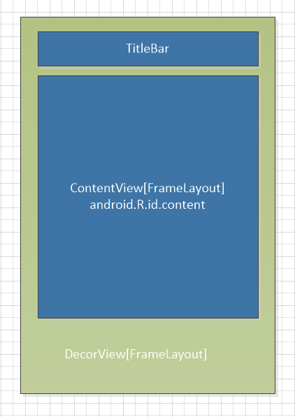
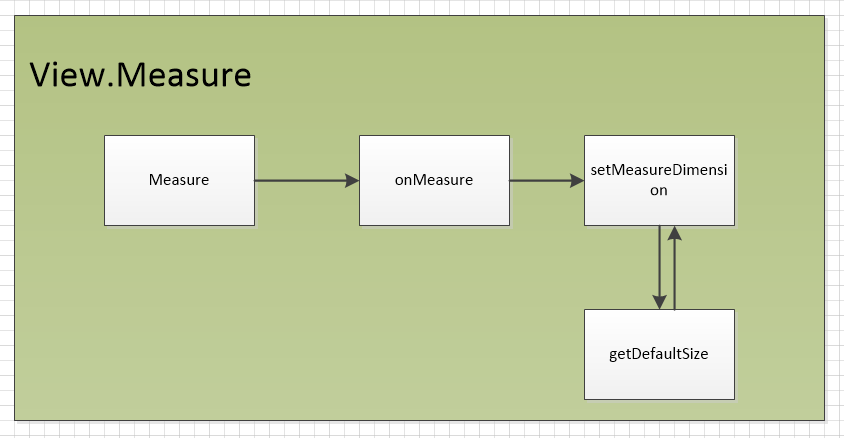
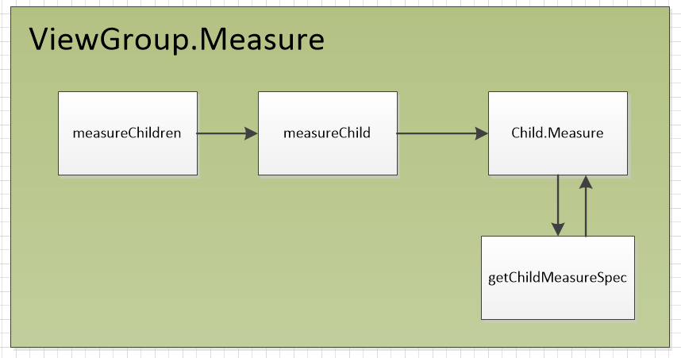
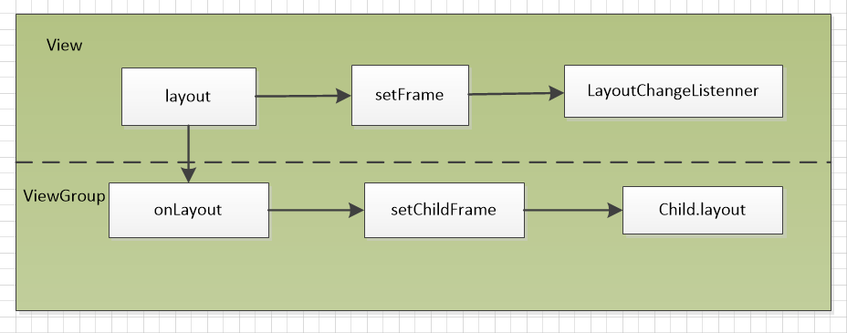

# Goals

- the three most important procedure of view -- Measure/Layout/Draw
- the scroll mechanism of view and the relation between this and the three procedure
- the input event mechanism in view
- important callback methods


# MeasureSpec

## 基本定义

`MeasureSpec`从字面上翻译是测量规格的意思，本质上是一个32位的整数，其中最高2位表示的是`MeasureModel`而用后面的30位表示大小。可以通过`MeasureSpec`的源代码进一步理解上面讲述的定义。

```java
public static class MeasureSpec {
  private static final int MODE_SHIFT = 30;
  private static final int MODE_MASK  = 0x3 << MODE_SHIFT;

  /**
   * Measure specification mode: The parent has not imposed any constraint
   * on the child. It can be whatever size it wants.
   */
  public static final int UNSPECIFIED = 0 << MODE_SHIFT;

  /**
   * Measure specification mode: The parent has determined an exact size
   * for the child. The child is going to be given those bounds regardless
   * of how big it wants to be.
   */
  public static final int EXACTLY     = 1 << MODE_SHIFT;

  /**
   * Measure specification mode: The child can be as large as it wants up
   * to the specified size.
   */
  public static final int AT_MOST     = 2 << MODE_SHIFT;

  /**
   * Creates a measure specification based on the supplied size and mode.
   *
   * The mode must always be one of the following:
   * <ul>
   *  <li>{@link android.view.View.MeasureSpec#UNSPECIFIED}</li>
   *  <li>{@link android.view.View.MeasureSpec#EXACTLY}</li>
   *  <li>{@link android.view.View.MeasureSpec#AT_MOST}</li>
   * </ul>
   *
   * <p><strong>Note:</strong> On API level 17 and lower, makeMeasureSpec's
   * implementation was such that the order of arguments did not matter
   * and overflow in either value could impact the resulting MeasureSpec.
   * {@link android.widget.RelativeLayout} was affected by this bug.
   * Apps targeting API levels greater than 17 will get the fixed, more strict
   * behavior.</p>
   *
   * @param size the size of the measure specification
   * @param mode the mode of the measure specification
   * @return the measure specification based on size and mode
   */
  public static int makeMeasureSpec(int size, int mode) {
      if (sUseBrokenMakeMeasureSpec) {
          return size + mode;
      } else {
          return (size & ~MODE_MASK) | (mode & MODE_MASK);
      }
  }

  /**
   * Like {@link #makeMeasureSpec(int, int)}, but any spec with a mode of UNSPECIFIED
   * will automatically get a size of 0. Older apps expect this.
   *
   * @hide internal use only for compatibility with system widgets and older apps
   */
  public static int makeSafeMeasureSpec(int size, int mode) {
      if (sUseZeroUnspecifiedMeasureSpec && mode == UNSPECIFIED) {
          return 0;
      }
      return makeMeasureSpec(size, mode);
  }

  /**
   * Extracts the mode from the supplied measure specification.
   *
   * @param measureSpec the measure specification to extract the mode from
   * @return {@link android.view.View.MeasureSpec#UNSPECIFIED},
   *         {@link android.view.View.MeasureSpec#AT_MOST} or
   *         {@link android.view.View.MeasureSpec#EXACTLY}
   */
  public static int getMode(int measureSpec) {
      return (measureSpec & MODE_MASK);
  }

  /**
   * Extracts the size from the supplied measure specification.
   *
   * @param measureSpec the measure specification to extract the size from
   * @return the size in pixels defined in the supplied measure specification
   */
  public static int getSize(int measureSpec) {
      return (measureSpec & ~MODE_MASK);
  }

  static int adjust(int measureSpec, int delta) {
      final int mode = getMode(measureSpec);
      int size = getSize(measureSpec);
      if (mode == UNSPECIFIED) {
          // No need to adjust size for UNSPECIFIED mode.
          return makeMeasureSpec(size, UNSPECIFIED);
      }
      size += delta;
      if (size < 0) {
          Log.e(VIEW_LOG_TAG, "MeasureSpec.adjust: new size would be negative! (" + size +
                  ") spec: " + toString(measureSpec) + " delta: " + delta);
          size = 0;
      }
      return makeMeasureSpec(size, mode);
  }

  /**
   * Returns a String representation of the specified measure
   * specification.
   *
   * @param measureSpec the measure specification to convert to a String
   * @return a String with the following format: "MeasureSpec: MODE SIZE"
   */
  public static String toString(int measureSpec) {
      int mode = getMode(measureSpec);
      int size = getSize(measureSpec);

      StringBuilder sb = new StringBuilder("MeasureSpec: ");

      if (mode == UNSPECIFIED)
          sb.append("UNSPECIFIED ");
      else if (mode == EXACTLY)
          sb.append("EXACTLY ");
      else if (mode == AT_MOST)
          sb.append("AT_MOST ");
      else
          sb.append(mode).append(" ");

      sb.append(size);
      return sb.toString();
  }
// }
```


# 三大流程之前

在开始介绍 View 的三大流程之前需要将关于 View 的一些想法捋捋清楚。

首先，应用程序的所有用户交互操作都基于图像内容的显示。这些显示给用户看到的图像内容都绘制在同一张 bitmap 中（雾，还没有考究过），通过不同 View 内容在 bitmap 上的叠加构成整个应用显示给用户看到的内容。每个 View 都有自身希望显示的图像内容，这些图像内容就是在 Measure 过程中所测量的对象。但是 View 所拥有的图像内容和用户在交互式看到的内容又存在一定的差别。在 View 的 Layout 过程中会控制 View 实际展示的部分，用 ViewTree 的角度来描述的做法可以说是父容器的显示范围内确定本身的显示位置和大小。最后才会在 Draw 流程中绘制需要显示的内容。从这个流程的执行步骤上来说会觉得有点奇怪，因为 Android 将绘制内容放在最后执行而在最开始的时候就去对 View 的大小进行测量，这样导致绘制出来的图像内容其实比测量出来的大小产生出入e 。所以从这个角度出发的话，其实 Measure 的过程并没有从根本上决定什么东西，只是提供了开发过程中需要用到的一些参数而已。

坐标系可能是在这个部分中最头疼的内容。 Android 的坐标系通常是参考于父容器的位置关系进行计算，但是 View 在发生移动之后坐标系的变化在不同的移动方式下就会变得诡异难测。



上图贴出了是一个 Activity 最开始的 View 结构。 DecorView 继承自 FrameLayout 是整个结构的顶层容器，包含在这个 Activity 对应的 Window 中（这部分的内容会在 Window 部分进行专门的介绍）；TitleBar 的存在与否取决于当前的采用的是那种主题； ContentView 是我们使用 setContentView 所操作的对象，需要使用的时候可以通过 android.R.id.content 这个ID进行获取。

# Measure

在开始介绍`Measure`流程之前有几点原则需要提及一下

- `MeasureSpec = ParentPadding + LayoutParams` 特殊的对于`DecorView`会有`MeasureSpec = ScreenSize + LayoutParams`。在这个计算公式中希望明确的一点是`View.MeasureSpec`由父容器的约束和自身的布局约束共同决定；其中，`ParentPadding`同时包含父容器的内边距和本身的外边距。

- `Measure`流程最终希望达到的目的是计算出`ViewTree`上每个`View/ViewGroup`的`MeasureSpec`并从中获取出并设置`View`的内容大小





上面的两张流程图分别介绍出`View/ViewGroup`在测量过程中函数的调用流程。在`ViewGroup.Measure`的函数调用流程中可能会诧异开始的函数位置不是`Measure`，这种情况是因为`ViewGroup`作为一个抽象类并没有实现`onMeasure`函数。但是在上面的流程图中表述了一种可以对该`ViewGroup`所属子树进行测量的方案，剩下的只是欠缺在所有子树测量完成之后怎么根据容器自己的规则来计算自己的大小，这些内容需要在实现`onMeasure`的时候去完成。接下来会针对上面流程图中比较重要的步骤进行解读。

- `getDefaultSize`

```java
protected void onMeasure(int widthMeasureSpec, int heightMeasureSpec) {
        setMeasuredDimension(getDefaultSize(getSuggestedMinimumWidth(), widthMeasureSpec),
                getDefaultSize(getSuggestedMinimumHeight(), heightMeasureSpec));
    }

/**
 * Utility to return a default size. Uses the supplied size if the
 * MeasureSpec imposed no constraints. Will get larger if allowed
 * by the MeasureSpec.
 *
 * @param size Default size for this view
 * @param measureSpec Constraints imposed by the parent
 * @return The size this view should be.
 */
public static int getDefaultSize(int size, int measureSpec) {
    int result = size;
    int specMode = MeasureSpec.getMode(measureSpec);
    int specSize = MeasureSpec.getSize(measureSpec);

    switch (specMode) {
    case MeasureSpec.UNSPECIFIED:
        result = size;
        break;
    case MeasureSpec.AT_MOST:
    case MeasureSpec.EXACTLY:
        result = specSize;
        break;
    }
    return result;
}
```

`getDefaultSize`会根据现有的规则从默认大小以及计算出来的`MeasureSpec`中计算出合适大小尺寸。但是在上面的源码中会有两个问题需要注意。第一点是在正常的测量流程中`MeasureSpec.UNSPECIFIED`基本不可能会出现所以也就不能取得到默认值；第二点是`MeasureSpec.AT_MOST/MeasureSpec.EXACTLY`两者取得都是同样的值（父容器剩余大小），这样的情况就会导致设置`wrap_content`不会产生任何的效果。所以需要在`onMeasure`的实现中需要对`wrap_content`的情况进行单独的处理。

- `getChildMeasureSpec`

在容器测量子树的过程中，前面的两个步骤只是一个对子树进行遍历的过程，真正的重点在于`getChildMeasureSpec`中如何结合自身的剩余空间和`子View`的布局规则计算出其对应的`MeasureSpec`从而调用其自身的测量过程设置大小。

```java
/**
 * Ask one of the children of this view to measure itself, taking into
 * account both the MeasureSpec requirements for this view and its padding.
 * The heavy lifting is done in getChildMeasureSpec.
 *
 * @param child The child to measure
 * @param parentWidthMeasureSpec The width requirements for this view
 * @param parentHeightMeasureSpec The height requirements for this view
 */
protected void measureChild(View child, int parentWidthMeasureSpec,
        int parentHeightMeasureSpec) {
    final LayoutParams lp = child.getLayoutParams();

    final int childWidthMeasureSpec = getChildMeasureSpec(parentWidthMeasureSpec,
            mPaddingLeft + mPaddingRight, lp.width);
    final int childHeightMeasureSpec = getChildMeasureSpec(parentHeightMeasureSpec,
            mPaddingTop + mPaddingBottom, lp.height);

    child.measure(childWidthMeasureSpec, childHeightMeasureSpec);
}

/**
     * Does the hard part of measureChildren: figuring out the MeasureSpec to
     * pass to a particular child. This method figures out the right MeasureSpec
     * for one dimension (height or width) of one child view.
     *
     * The goal is to combine information from our MeasureSpec with the
     * LayoutParams of the child to get the best possible results. For example,
     * if the this view knows its size (because its MeasureSpec has a mode of
     * EXACTLY), and the child has indicated in its LayoutParams that it wants
     * to be the same size as the parent, the parent should ask the child to
     * layout given an exact size.
     *
     * @param spec The requirements for this view
     * @param padding The padding of this view for the current dimension and
     *        margins, if applicable
     * @param childDimension How big the child wants to be in the current
     *        dimension
     * @return a MeasureSpec integer for the child
     */
    public static int getChildMeasureSpec(int spec, int padding, int childDimension) {
        int specMode = MeasureSpec.getMode(spec);
        int specSize = MeasureSpec.getSize(spec);

        int size = Math.max(0, specSize - padding);

        int resultSize = 0;
        int resultMode = 0;

        switch (specMode) {
        // Parent has imposed an exact size on us
        case MeasureSpec.EXACTLY:
            if (childDimension >= 0) {
                resultSize = childDimension;
                resultMode = MeasureSpec.EXACTLY;
            } else if (childDimension == LayoutParams.MATCH_PARENT) {
                // Child wants to be our size. So be it.
                resultSize = size;
                resultMode = MeasureSpec.EXACTLY;
            } else if (childDimension == LayoutParams.WRAP_CONTENT) {
                // Child wants to determine its own size. It can't be
                // bigger than us.
                resultSize = size;
                resultMode = MeasureSpec.AT_MOST;
            }
            break;

        // Parent has imposed a maximum size on us
        case MeasureSpec.AT_MOST:
            if (childDimension >= 0) {
                // Child wants a specific size... so be it
                resultSize = childDimension;
                resultMode = MeasureSpec.EXACTLY;
            } else if (childDimension == LayoutParams.MATCH_PARENT) {
                // Child wants to be our size, but our size is not fixed.
                // Constrain child to not be bigger than us.
                resultSize = size;
                resultMode = MeasureSpec.AT_MOST;
            } else if (childDimension == LayoutParams.WRAP_CONTENT) {
                // Child wants to determine its own size. It can't be
                // bigger than us.
                resultSize = size;
                resultMode = MeasureSpec.AT_MOST;
            }
            break;

        // Parent asked to see how big we want to be
        case MeasureSpec.UNSPECIFIED:
            if (childDimension >= 0) {
                // Child wants a specific size... let him have it
                resultSize = childDimension;
                resultMode = MeasureSpec.EXACTLY;
            } else if (childDimension == LayoutParams.MATCH_PARENT) {
                // Child wants to be our size... find out how big it should
                // be
                resultSize = View.sUseZeroUnspecifiedMeasureSpec ? 0 : size;
                resultMode = MeasureSpec.UNSPECIFIED;
            } else if (childDimension == LayoutParams.WRAP_CONTENT) {
                // Child wants to determine its own size.... find out how
                // big it should be
                resultSize = View.sUseZeroUnspecifiedMeasureSpec ? 0 : size;
                resultMode = MeasureSpec.UNSPECIFIED;
            }
            break;
        }
        return MeasureSpec.makeMeasureSpec(resultSize, resultMode);
    }
```

可以从`getChildMeasureSpec`的源码中印证最初提及到的计算`MeasureSpec`的计算公式，有个细节的地方是在传入`padding`参数的时候是否需要考虑到`子View`本身的外边距空间。

# Layout



上面的流程图显示的`View/ViewGroup`的`Layout`过程，只有在`ViewGroup`的时候才会执行到下面的一层

- Layout

```java
/**
 * Assign a size and position to a view and all of its
 * descendants
 *
 * <p>This is the second phase of the layout mechanism.
 * (The first is measuring). In this phase, each parent calls
 * layout on all of its children to position them.
 * This is typically done using the child measurements
 * that were stored in the measure pass().</p>
 *
 * <p>Derived classes should not override this method.
 * Derived classes with children should override
 * onLayout. In that method, they should
 * call layout on each of their children.</p>
 *
 * @param l Left position, relative to parent
 * @param t Top position, relative to parent
 * @param r Right position, relative to parent
 * @param b Bottom position, relative to parent
 */
@SuppressWarnings({"unchecked"})
public void layout(int l, int t, int r, int b) {
    if ((mPrivateFlags3 & PFLAG3_MEASURE_NEEDED_BEFORE_LAYOUT) != 0) {
        onMeasure(mOldWidthMeasureSpec, mOldHeightMeasureSpec);
        mPrivateFlags3 &= ~PFLAG3_MEASURE_NEEDED_BEFORE_LAYOUT;
    }

    int oldL = mLeft;
    int oldT = mTop;
    int oldB = mBottom;
    int oldR = mRight;

    boolean changed = isLayoutModeOptical(mParent) ?
            setOpticalFrame(l, t, r, b) : setFrame(l, t, r, b);

    if (changed || (mPrivateFlags & PFLAG_LAYOUT_REQUIRED) == PFLAG_LAYOUT_REQUIRED) {
        onLayout(changed, l, t, r, b);
        mPrivateFlags &= ~PFLAG_LAYOUT_REQUIRED;

        ListenerInfo li = mListenerInfo;
        if (li != null && li.mOnLayoutChangeListeners != null) {
            ArrayList<OnLayoutChangeListener> listenersCopy =
                    (ArrayList<OnLayoutChangeListener>)li.mOnLayoutChangeListeners.clone();
            int numListeners = listenersCopy.size();
            for (int i = 0; i < numListeners; ++i) {
                listenersCopy.get(i).onLayoutChange(this, l, t, r, b, oldL, oldT, oldR, oldB);
            }
        }
    }

    mPrivateFlags &= ~PFLAG_FORCE_LAYOUT;
    mPrivateFlags3 |= PFLAG3_IS_LAID_OUT;
}

@Override
public final void layout(int l, int t, int r, int b) {
    if (!mSuppressLayout && (mTransition == null || !mTransition.isChangingLayout())) {
        if (mTransition != null) {
            mTransition.layoutChange(this);
        }
        super.layout(l, t, r, b);
    } else {
        // record the fact that we noop'd it; request layout when transition finishes
        mLayoutCalledWhileSuppressed = true;
    }
}
```

上面分别是`View/ViewGroup`中`layout`函数的实现。在`View.layout`中，默认的实现调用`setFrame`函数设置自身四个定点的坐标从而确定自身的位置和大小。然后到了`ViewGroup.layout`的实现的时候就已经将这个函数写成`final`类型保证所有`ViewGroup`的实现都设置了自身的`layout`。

- onLayout

因为自身的位置属性在`layout`中已经设置完毕，所以，在这个阶段主要负责对子树的定位操作。

# Draw （略）
