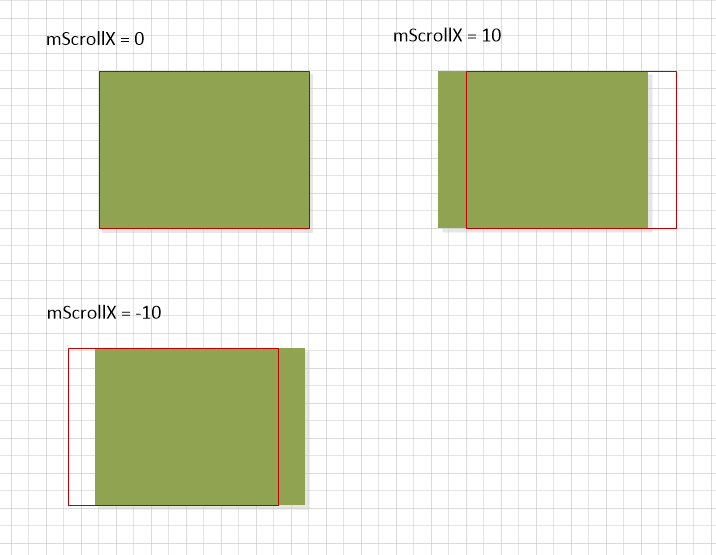

> 移动设备的显示屏幕尺寸很大程度显示了应用程序界面的显示，为了在这种限制条件下让应用程序可以展现更多的内容，就不得不研究`View`移动相关的内容。在这里提及到的移动其实包含了两个层面的意义。就像在讨论`View`三大流程时介绍的那样，在显示上将`View`划分了内容和显示区域两个部分。所以这里的移动这是分别针对这两个方面的移动进行介绍

# 相关参数

```java
int mScrollX, mScrollY;

int mLeft, mTop, mRight, mBottom;

float x, y, translationX, translationY;
```

`View`中有三组不同的参数都可以用来实现移动的效果。这些参数拥有着各自不同的影响范围并且存在一定的关联，下面分别介绍这些属性如何实现移动的效果，并且在这个过程中对其所在`ViewTree`的三大流程产生怎么样的影响。

## mScrollX & mScrollY



这两个参数通过控制`View`的显示区域和其内容的相对偏移位置来达到内容移动的效果，也就是说`View`还是在原来的位置，但是其内容显示的内容在发生移动。这种方式的使用场景通常是针对于那些内容大小超出显示区域的`View/ViewGroup`。

上面的图片表示的是随着显示内容和显示区域的相对偏移，横向坐标偏移参数发生的变化。如果按照正常的显示坐标系的方向进行理解，只能够将上面的两个参数理解成为显示视窗在初始坐标系下的坐标位置。

```java
/**
 * Set the scrolled position of your view. This will cause a call to
 * {@link #onScrollChanged(int, int, int, int)} and the view will be
 * invalidated.
 * @param x the x position to scroll to
 * @param y the y position to scroll to
 */
public void scrollTo(int x, int y) {
    if (mScrollX != x || mScrollY != y) {
        int oldX = mScrollX;
        int oldY = mScrollY;
        mScrollX = x;
        mScrollY = y;
        invalidateParentCaches();
        onScrollChanged(mScrollX, mScrollY, oldX, oldY);
        if (!awakenScrollBars()) {
            postInvalidateOnAnimation();
        }
    }
}

/**
 * Move the scrolled position of your view. This will cause a call to
 * {@link #onScrollChanged(int, int, int, int)} and the view will be
 * invalidated.
 * @param x the amount of pixels to scroll by horizontally
 * @param y the amount of pixels to scroll by vertically
 */
public void scrollBy(int x, int y) {
    scrollTo(mScrollX + x, mScrollY + y);
}

```

`View`提供上面的两个方法操作偏移参数，两个方法之间的差别也是一目了然。但是提供的这两个参数都是之后实现瞬时的偏移做不到的平滑的偏移运动，实现这种平滑的过度效果还需加入其他的辅助内容，这在后面会进行介绍。

使用`scrollTo/scrollBy`的方式实现内容的偏移不会触发三大流程中的任何一种，性能的消耗会比较小。

## translate

&& x = mLeft + translationX &&

&& y = mTop + translationY &&

剩下的两组参数之间会存在着这样的一种关系。使用这种移动方式会将`View`进行一个整体的移动，包括内容和视窗

使用这组属性进行`View`的移动可以有两种选择

- X/Y/translationX/translationY

在使用这组属性进行移动操作的时候，不管改变的是哪一个参数都会同时改变对应的另外一个参数来维持上面的等式成立，但是在这个过程中并不会去涉及`Layout`四个相关参数的改变。同时使用这组参数进行位移的时候不会触发三大流程里面的任何一个。

- mLeft/mTop/mRight/mBottom

这组参数使用时必须要手动的调用`invalidated`函数触发`Layout`的过程从而让参数的修改体现出来。同时对这些参数的修改也会自动的位置上面等式的成立也就意味着会改变上面的参数。这个时候就会发现这样一个现象，通过这两个不同的移动方式的混合调用最后会达到这样的一种效果：mLeft的取值不能够正确的反映出`View`的位置，而`X`的值从始至终都可以很好的跟随`View`移动的步调。这种方法在实现的原理上本身就有着自己的局限，那就是必须强制地走一遍三个流程，消耗一定的性能。

# 平滑过渡

要实现平滑过渡的效果需要侦测手指离开时刻的速度同时还需要一个时间序列事件来持续性的修改上面的属性。速度侦测使用`VelocityTracker`类提供的接口进行，而时间序列事件的选择就会更加的广泛。时间序列时间的选择属性动画或者是`Handler`，在这里使用的是另外的一种取巧的方式——在`View.computeScroll`触发界面刷新致使该函数持续性调用直到满足结束条件。这个时候可以使用`Scroller`作为辅助类或者是自己实现一个时间插值器来更新对应的属性（看一眼源码的话可以发现`Scroller`不仅仅可以用于更新`mScrollX/mScrollY`）。

- VelocityTracker
